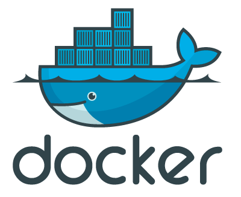
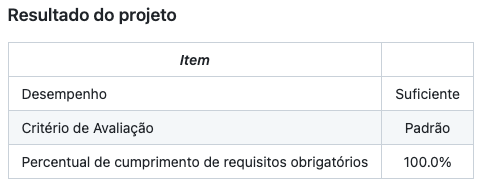
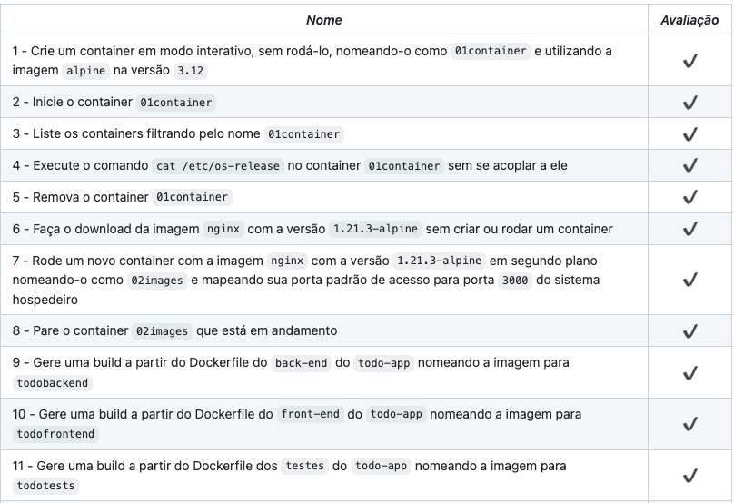

# Docker - Back-End Project

Coomandos do docker CLI com diferentes níveis de complexidade.



Conteinerizar (empacotar) uma aplicações front, back e de testes e criar uma conexão entre elas;
Orquestrar seu funcionamento.

Projeto 18 da [Trybe](https://wwww.betrybe.com), módulo de Back-End.



## O Projeto

#### Comandos CLI de Docker:
- Para criar container Docker: `docker container create -i --name 01container alpine:3.12`
- Para startar o container Docker: `docker container start 01container`
- Para listar containers: `docker ps --filter "name=01container"``
- Para apagar um container: `docker rm -f 01container`

#### Criando uma imagem com Dockerfile:
   - `FROM node:14-alpine AS todobackend`: criando uma imagem de node que se chama todobackend
   - `EXPOSE 3001`: utilizando a porta 3001
   - `WORKDIR /usr/app`: para criar um novo diretório
   - `COPY todobackend /todo-app/black-end/` ou `COPY . .`: copiar tudo da máquina para a imagem
   - `CMD ["npm", "start"]`: array que vai concatenar e rodar os comandos
 
#### Docker-compose:
- Criar um arquivo `docker-compose.yml` com as imagens e nome dos containers para as aplicações de front, back e testes
- Para subir os container em segundo plano, comando cli: `docker-compose up -d`



## Instalação 

#### 1- Clonar o repositório

```git clone git@github.com:sallybdiament/Project-19-MySQL-All-For-One.git```

#### 2 - Instalar as dependências

Acessar o projeto e rodar o ```npm install```

## Ferramentas
 - Docker
 - Docker CLI
 - Dockerfile
 - Docker compose
